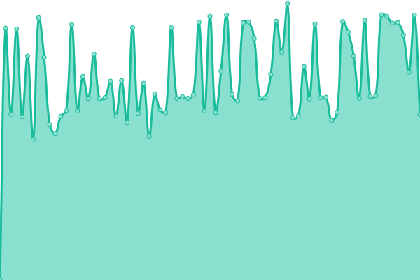

# [📈 Live Status](https://fogWraith.github.io/status): <!--live status--> **🟧 Partial outage**

This repository contains the open-source uptime monitor and status page for [fogWraith](https://fogWraith.github.io/status), powered by [Upptime](https://github.com/upptime/upptime).

With [Upptime](https://upptime.js.org), you can get your own unlimited and free uptime monitor and status page, powered entirely by a GitHub repository. We use [Issues](https://github.com/fogWraith/status/issues) as incident reports, [Actions](https://github.com/fogWraith/status/actions) as uptime monitors, and [Pages](https://fogWraith.github.io/status) for the status page.

<!--start: status pages-->
<!-- This summary is generated by Upptime (https://github.com/upptime/upptime) -->
<!-- Do not edit this manually, your changes will be overwritten -->
<!-- prettier-ignore -->
| URL | Status | History | Response Time | Uptime |
| --- | ------ | ------- | ------------- | ------ |
|  [Macintosh Garden](https://macintoshgarden.org) | 🟥 Down | [macintosh-garden.yml](https://github.com/fogWraith/status/commits/HEAD/history/macintosh-garden.yml) | 

 780ms
     
 | 

<a href="https://status.macintosh.garden/history/macintosh-garden">97.32%</a>
    

|  [DE Archive Mirror](https://old.mac.gdn) | 🟩 Up | [de-archive-mirror.yml](https://github.com/fogWraith/status/commits/HEAD/history/de-archive-mirror.yml) | 

 254ms
     
 | 

<a href="https://status.macintosh.garden/history/de-archive-mirror">100.00%</a>
    

|  [SE Archive Mirror](62.116.228.143) | 🟩 Up | [se-archive-mirror.yml](https://github.com/fogWraith/status/commits/HEAD/history/se-archive-mirror.yml) | 

 120ms
     
 | 

<a href="https://status.macintosh.garden/history/se-archive-mirror">100.00%</a>
    

|  [US Archive Mirror](http://mirror.macintosharchive.org) | 🟥 Down | [us-archive-mirror.yml](https://github.com/fogWraith/status/commits/HEAD/history/us-archive-mirror.yml) | 

 0ms
     
 | 

<a href="https://status.macintosh.garden/history/us-archive-mirror">0.00%</a>
    

|  [Macintosh Garden (DEV)](https://macintosh.garden) | 🟩 Up | [macintosh-garden-dev.yml](https://github.com/fogWraith/status/commits/HEAD/history/macintosh-garden-dev.yml) | 

 264ms
     
 | 

<a href="https://status.macintosh.garden/history/macintosh-garden-dev">100.00%</a>
    

|  [Revontulet](https://revontulet.org) | 🟥 Down | [revontulet.yml](https://github.com/fogWraith/status/commits/HEAD/history/revontulet.yml) | 

 547ms
     
 | 

<a href="https://status.macintosh.garden/history/revontulet">93.42%</a>
    

|  [System 7 Today](https://system7today.com) | 🟩 Up | [system-7-today.yml](https://github.com/fogWraith/status/commits/HEAD/history/system-7-today.yml) | 

 86ms
     
 | 

<a href="https://status.macintosh.garden/history/system-7-today">100.00%</a>
    

<!--end: status pages-->

[**Visit our status website →**](https://fogWraith.github.io/status)

## 📄 License

- Powered by: [Upptime](https://github.com/upptime/upptime)
- Code: [MIT](./LICENSE) © [fogWraith](https://fogWraith.github.io/status)
- Data in the `./history` directory: [Open Database License](https://opendatacommons.org/licenses/odbl/1-0/)
